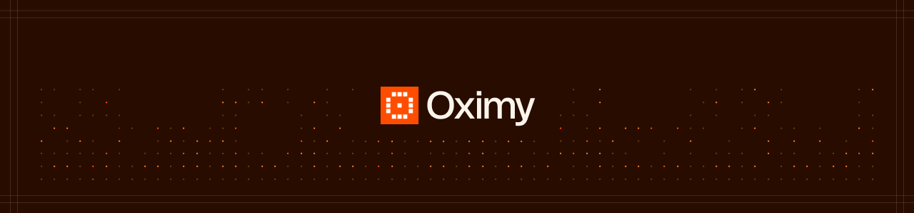

# Oximy Sensor

> The open-source desktop agent that monitors AI tool usage across your organization

## What it does

Oximy Sensor runs on employee devices and monitors network connections to detect AI tool usage. It captures what AI applications are being accessed—ChatGPT, Claude, Gemini, and 2,200+ other models—without requiring any code changes or SDK integration.

## How it works

The sensor intercepts TLS at the system boundary, logging:
- Which AI tools and models are being used
- When requests are made
- Which devices are making them
- Request/response metadata

All events are sent to your Oximy dashboard for centralized visibility and governance.

## See it in action

**[📅 Book a 30-minute demo](https://oximy.link/demo)** to see how organizations are using Oximy to govern AI usage across their workforce.

In the demo, we'll show you:
- Live AI activity detection across your tools
- Custom policy enforcement in action
- Real-world governance workflows
- How to go from install to visibility in 90 seconds

## Key features

- **Zero instrumentation**: No code changes, no SDK integration
- **Comprehensive coverage**: 2,200+ AI models, 100+ apps, 500+ websites
- **Privacy-first**: Configurable data capture policies
- **Open standard**: Fully auditable, open-source sensor
- **90 seconds to first detection**: From install to visibility

## Use cases

- Shadow AI discovery
- Compliance & audit trails  
- AI governance & policy enforcement
- Usage analytics & cost tracking

## Audit the code

This repository is fully open source so you can verify exactly what runs on your devices. Key areas to review:

| Directory | Purpose |
|-----------|---------|
| [`OximyMac/`](OximyMac/) | macOS sensor application |
| [`OximyWindows/`](OximyWindows/) | Windows sensor application |
| [`mitmproxy/addons/`](mitmproxy/addons/) | Network interception addons |
| [`registry/`](registry/) | AI apps, websites, and model definitions |

## Resources

- [Documentation](https://docs.oximy.com)
- [Website](https://oximy.com)
- [Request Demo](https://oximy.link/demo)

## Questions?

The fastest way to understand if Oximy is right for your organization is a quick demo.

**[Schedule a demo →](https://oximy.link/demo)**

---

## Acknowledgments

Oximy Sensor is built on the shoulders of giants:

- **[mitmproxy](https://mitmproxy.org)** — The powerful open-source TLS interception library that powers our network monitoring capabilities
- **[models.dev](https://models.dev)** ([GitHub](https://github.com/anomalyco/models.dev)) — Open database of AI models and providers that powers our detection coverage

---

**[We're hiring →](https://oximy.link/careers)**

Made with ❤️ in SF for 🌍   