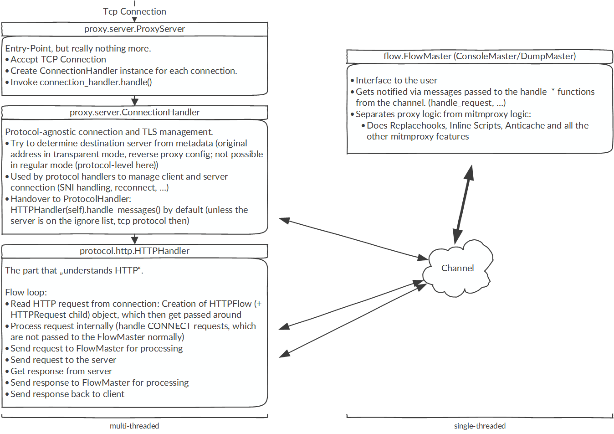

.. _architecture:

Architecture
============

To give you a better understanding of how mitmproxy works, mitmproxy's
high-level architecture is detailed in the following graphic:

:download:`architecture.pdf <../schematics/architecture.pdf>`

Please don't refrain from asking any further
questions on the mailing list, the Slack channel or the GitHub issue tracker.
