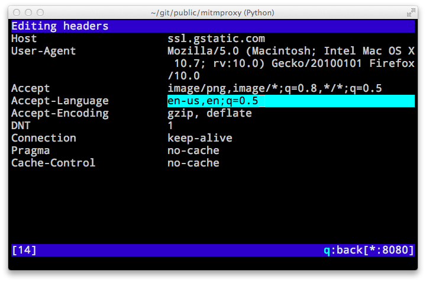
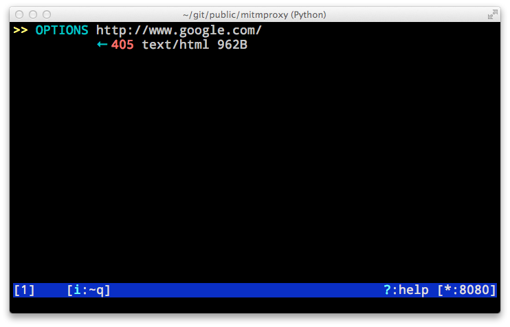

.. _mitmproxy:
.. program:: mitmproxy

mitmproxy
=========

**mitmproxy** is a console tool that allows interactive examination and
modification of HTTP traffic. It differs from mitmdump in that all flows are
kept in memory, which means that it's intended for taking and manipulating
small-ish samples. Use the :kbd:`?` shortcut key to view, context-sensitive
documentation from any **mitmproxy** screen.

Flow list
---------

The flow list shows an index of captured flows in chronological order.

- **1**: A GET request, returning a 302 Redirect response.
- **2**: A GET request, returning 16.75kb of text/html data.
- **3**: A replayed request.
- **4**: Intercepted flows are indicated with orange text. The user may edit
  these flows, and then accept them (using the :kbd:`a` key) to continue. In this
  case, the request has been intercepted on the way to the server.
- **5**: A response intercepted from the server on the way to the client.
- **6**: The event log can be toggled on and off using the :kbd:`e` shortcut key. This
  pane shows events and errors that may not result in a flow that shows up in the
  flow pane.
- **7**: Flow count.
- **8**: Various information on mitmproxy's state. In this case, we have an
  interception pattern set to ``.*``.
- **9**: Bind address indicator - mitmproxy is listening on port 8080 of all
  interfaces.

Flow view
---------

The **Flow View** lets you inspect and manipulate a single flow:

- **1**: Flow summary.
- **2**: The Request/Response tabs, showing you which part of the flow you are
  currently viewing. In the example above, we're viewing the Response. Hit :kbd:`tab`
  to switch between the Response and the Request.
- **3**: Headers.
- **4**: Body.
- **5**: View Mode indicator. In this case, we're viewing the body in **hex** mode. The other
  available modes are **pretty**, which uses a number of heuristics to show you a friendly
  view of various content types, and **raw**, which shows you exactly what's there without any
  changes. You can change modes using the :kbd:`m` key.

Grid Editor
-----------

Much of the data that we'd like to interact with in mitmproxy is structured.
For instance, headers, queries and form data can all be thought of as a list of
key/value pairs. Mitmproxy has a built-in editor that lays this type of data
out in a grid for easy manipulation.

At the moment, the Grid Editor is used in four parts of mitmproxy:

  - Editing request or response headers (:kbd:`e` for edit, then :kbd:`h` for headers in flow view)
  - Editing a query string (:kbd:`e` for edit, then :kbd:`q` for query in flow view)
  - Editing a URL-encoded form (:kbd:`e` for edit, then :kbd:`f` for form in flow view)
  - Editing replacement patterns (:kbd:`o` for options, then :kbd:`R` for Replacement Patterns)

If there is is no data, an empty editor will be started to let you add some.
Here is the editor showing the headers from a request:

To edit, navigate to the key or value you want to modify using the arrow or vi
navigation keys, and press enter. The background color will change to show that
you are in edit mode for the specified field:

Modify the field as desired, then press escape to exit edit mode when you're
done. You can also add a row (:kbd:`a` key), delete a row (:kbd:`d` key), spawn an
external editor on a field (:kbd:`e` key). Be sure to consult the context-sensitive
help (:kbd:`?` key) for more.

Example: Interception
---------------------

**mitmproxy**'s interception functionality lets you pause an HTTP request or
response, inspect and modify it, and then accept it to send it on to the server
or client.

1: Set an interception pattern
^^^^^^^^^^^^^^^^^^^^^^^^^^^^^^

.. image:: screenshots/mitmproxy-intercept-filt.png

We press :kbd:`i` to set an interception pattern. In this case, the ``~q`` filter
pattern tells **mitmproxy** to intercept all requests. For complete filter
syntax, see the :ref:`filters` section of the documentation,
or the built-in help function in **mitmproxy**.

2: Intercepted connections are indicated with orange text:
^^^^^^^^^^^^^^^^^^^^^^^^^^^^^^^^^^^^^^^^^^^^^^^^^^^^^^^^^^

.. image:: screenshots/mitmproxy-intercept-mid.png

3: You can now view and modify the request:
^^^^^^^^^^^^^^^^^^^^^^^^^^^^^^^^^^^^^^^^^^^

In this case, we viewed the request by selecting it, pressed :kbd:`e` for "edit"
and :kbd:`m` for "method" to change the HTTP request method.

4: Accept the intercept to continue:
^^^^^^^^^^^^^^^^^^^^^^^^^^^^^^^^^^^^

Finally, we press :kbd:`a` to accept the modified request, which is then sent on to
the server. In this case, we changed the request from an HTTP GET to
OPTIONS, and Google's server has responded with a 405 "Method not allowed".
