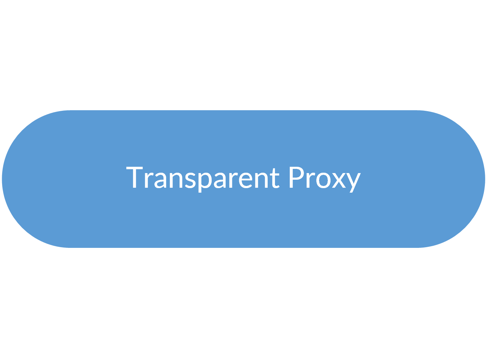
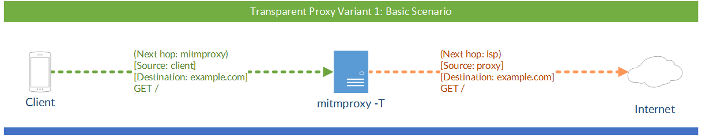
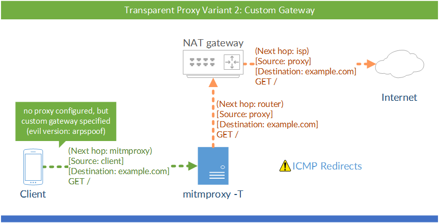
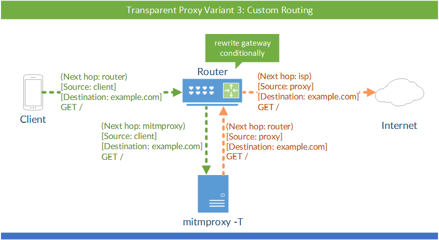
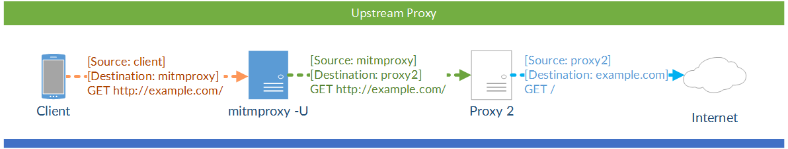

.. _modes:

Modes of Operation
==================

Mitmproxy has four modes of operation that allow you to use mitmproxy in a
variety of scenarios:

- **Regular** (the default)
- **Transparent**
- **Reverse Proxy**
- **Upstream Proxy**

Now, which one should you pick? Use this flow chart:

Regular Proxy
-------------

Mitmproxy's regular mode is the simplest and the easiest to set up.

1. Start mitmproxy.
2. Configure your client to use mitmproxy by explicitly setting an HTTP proxy.
3. Quick Check: You should already be able to visit an unencrypted HTTP site through the proxy.
4. Open the magic domain **mitm.it** and install the certificate for your device.

.. note::
    Unfortunately, some applications bypass the system HTTP proxy settings - Android applications
    are a common example. In these cases, you need to use mitmproxy's transparent mode.

If you are proxying an external device, your network will probably look like this:

.. image:: schematics/proxy-modes-regular.png
    :align: center

The square brackets signify the source and destination IP addresses. Your
client explicitly connects to mitmproxy and mitmproxy explicitly connects
to the target server.

Transparent Proxy
-----------------

In transparent mode, traffic is directed into a proxy at the network layer,
without any client configuration required. This makes transparent proxying
ideal for situations where you can't change client behaviour. In the graphic
below, a machine running mitmproxy has been inserted between the router and
the internet:

The square brackets signify the source and destination IP addresses. Round
brackets mark the next hop on the *Ethernet/data link* layer. This distinction
is important: when the packet arrives at the mitmproxy machine, it must still
be addressed to the target server. This means that Network Address Translation
should not be applied before the traffic reaches mitmproxy, since this would
remove the target information, leaving mitmproxy unable to determine the real
destination.

.. image:: schematics/proxy-modes-transparent-wrong.png
    :align: center

Common Configurations
^^^^^^^^^^^^^^^^^^^^^

There are many ways to configure your network for transparent proxying. We'll
look at two common scenarios:

1. Configuring the client to use a custom gateway/router/"next hop"
2. Implementing custom routing on the router

In most cases, the first option is recommended due to its ease of use.

(a) Custom Gateway
~~~~~~~~~~~~~~~~~~

One simple way to get traffic to the mitmproxy machine with the destination IP
intact, is to simply configure the client with the mitmproxy box as the
default gateway.

In this scenario, we would:

1. Configure the proxy machine for transparent mode. You can find instructions
   in the :ref:`transparent` section.
2. Configure the client to use the proxy machine's IP as the default gateway.
3. Quick Check: At this point, you should already be able to visit an
   unencrypted HTTP site over the proxy.
4. Open the magic domain **mitm.it** and install the certificate
   for your device.

Setting the custom gateway on clients can be automated by serving the settings
out to clients over DHCP. This lets set up an interception network where all
clients are proxied automatically, which can save time and effort.

.. admonition:: Troubleshooting Transparent Mode
    :class: note

    Incorrect transparent mode configurations are a frequent source of
    error. If it doesn't work for you, try the following things:

    - Open mitmproxy's event log (press :kbd:`e`) - do you see clientconnect messages?
      If not, the packets are not arriving at the proxy. One common cause is the occurrence of ICMP
      redirects, which means that your machine is telling the client that there's a faster way to
      the internet by contacting your router directly (see the :ref:`transparent` section on how to
      disable them). If in doubt, Wireshark_ may help you to see whether something arrives at your
      machine or not.
    - Make sure you have not explicitly configured an HTTP proxy on the client.
      This is not needed in transparent mode.
    - Re-check the instructions in the :ref:`transparent` section. Anything you missed?

    If you encounter any other pitfalls that should be listed here, please let us know!

(b) Custom Routing
~~~~~~~~~~~~~~~~~~

In some cases, you may need more fine-grained control of which traffic reaches
the mitmproxy instance, and which doesn't. You may, for instance, choose only
to divert traffic to some hosts into the transparent proxy. There are a huge
number of ways to accomplish this, and much will depend on the router or
packet filter you're using. In most cases, the configuration will look like
this:

Reverse Proxy
-------------

mitmproxy is usually used with a client that uses the proxy to access the
Internet. Using reverse proxy mode, you can use mitmproxy to act like a normal
HTTP server:

.. image:: schematics/proxy-modes-reverse.png
    :align: center

There are various use-cases:

- Say you have an internal API running at http://example.local/. You could now
  set up mitmproxy in reverse proxy mode at http://debug.example.local/ and
  dynamically point clients to this new API endpoint, which provides them
  with the same data and you with debug information. Similarly, you could move
  your real server to a different IP/port and set up mitmproxy in the original
  place to debug and or redirect all sessions.

- Say you're a web developer working on http://example.com/ (with a development
  version running on http://localhost:8000/). You can modify your hosts file so that
  example.com points to 127.0.0.1 and then run mitmproxy in reverse proxy mode
  on port 80. You can test your app on the example.com domain and get all
  requests recorded in mitmproxy.

- Say you have some toy project that should get SSL support. Simply set up
  mitmproxy as a reverse proxy on port 443 and you're done (``mitmdump -p 443 -R
  http://localhost:80/``). Mitmproxy auto-detects TLS traffic and intercepts it dynamically.
  There are better tools for this specific task, but mitmproxy is very quick and simple way to
  set up an SSL-speaking server.

- Want to add a non-SSL-capable compression proxy in front of your server? You
  could even spawn a mitmproxy instance that terminates SSL (``-R http://...``),
  point it to the compression proxy and let the compression proxy point to a
  SSL-initiating mitmproxy (``-R https://...``), which then points to the real
  server. As you see, it's a fairly flexible thing.

.. admonition:: Caveat: Interactive Use
    :class: warning

    Reverse Proxy mode is usually not sufficient to create a copy of an interactive website at
    different URL. The HTML served to the client remains unchanged - as soon as the user clicks on
    an non-relative URL (or downloads a non-relative image resource), traffic no longer passes
    through mitmproxy.

Upstream Proxy
--------------

If you want to chain proxies by adding mitmproxy in front of a different proxy
appliance, you can use mitmproxy's upstream mode. In upstream mode, all
requests are unconditionally transferred to an upstream proxy of your choice.

mitmproxy supports both explicit HTTP and explicit HTTPS in upstream proxy
mode. You could in theory chain multiple mitmproxy instances in a row, but
that doesn't make any sense in practice (i.e. outside of our tests).

.. _Wireshark: https://wireshark.org/
