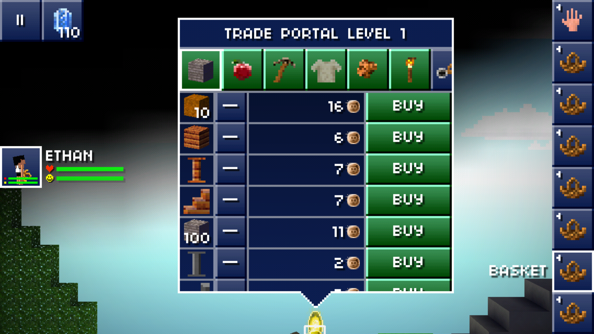
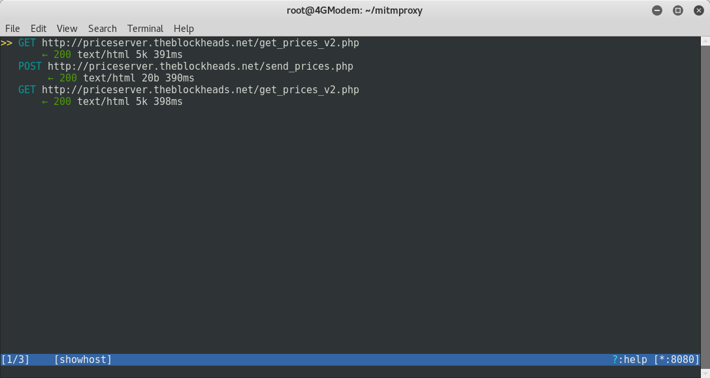
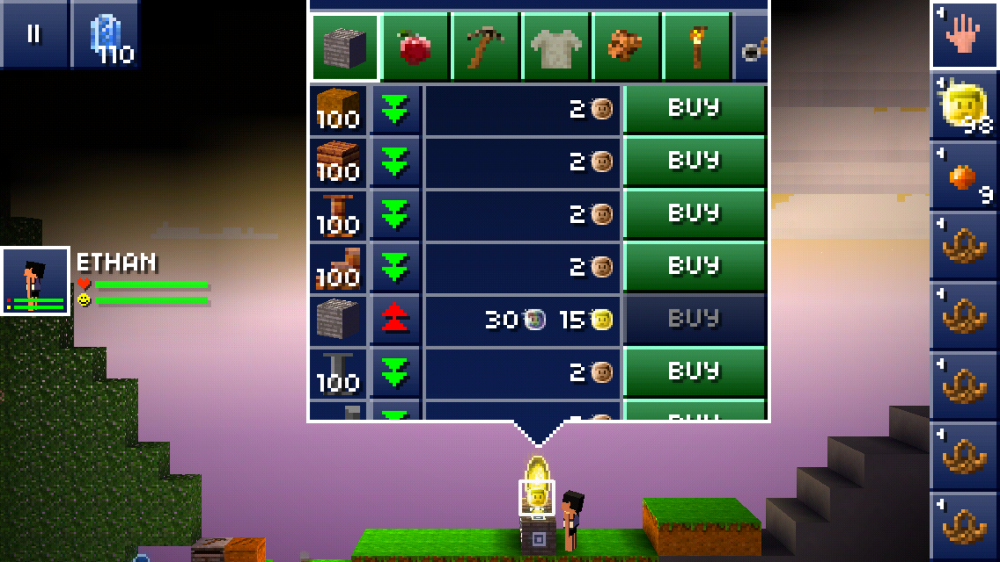

.. _blockheads:

Reversing a third-party game API
================================

The setup
---------

In this tutorial, I'm going to show you how to reverse the traffic from an Android game to an HTTP API
endpoint using mitmproxy. To set things up, start mitmproxy on your computer and
then configure your Android phone to use the computer as it's proxy (for example by setting up a rogue access point).
You don't have to install a root CA on the phone since all requests of the app used in this tutorial are made over HTTP.

Taking a look at the traffic from the app
-----------------------------------------

The game I'll use in this tutorial is called `The Blockheads`_ - a Minecraft-like game that lets you explore
the world, mine for resources, build structures, craft some items and sell them in a trade portal for in-game
currency. Selling and buying items does not only affect the price of items on your device,
but it also affects the global trade portal price. This means that if you for example sell 200 lanterns,
the global price for lanterns will go down and lanterns will become cheaper for everyone (according to the law of supply and demand).
The goal today will be to reverse engineer the trading mechanism and to intercept and modify the prices in order to chea.. uh progress quicker.

After buying some items, you can see the traffic flowing trough mitmproxy:

We see a two types of requests: to ``http://priceserver.theblockheads.net/get_prices_v2.php`` and to
``http://priceserver.theblockheads.net/send_prices.php``. As you guessed it, this gets and sends prices.

The contents of the responses of ``/get_prices_v2.php`` are interesting:

.. code-block:: none

   HTTP/1.1 200 OK
   Date: Sat, 04 Jun 2016 16:38:07 GMT
   Server: Apache/2.2.22 (Ubuntu)
   X-Powered-By: PHP/5.3.10-1ubuntu3.23
   Vary: Accept-Encoding
   Content-Length: 17840
   Connection: close
   Content-Type: text/html

   [{"id":"3","price":"2.8175381957393","old_price":"2.8044553060275"},{"id":"4","price":"2.1769570306995","old_price":"1.8316006765681"},{"id":"6","price":"22.68952525272","old_price":"21.788246130337"},{"id":"7","price":"20.052151822058","old_price":"19.679617830273"},{"id":"8","price":"36.492462038641","old_price":"33.657082338417"},{"id":"12","price":"19.15582354816","old_price":"19.036818986992"},{"id":"13","price":"6.9189193473413","old_price":"6.2812749984002"},{"id":"14","price":"8.2122077112638","old_price":"7.767583310962"},{"id":"16","price":"3.0144880616194","old_price":"3.0253902395237"},{"id":"17","price":"5.5274764518263","old_price":"5.8981035789504"},{"id":"21","price":"3.9075126678274","old_price":"3.8031927705026"},{"id":"22","price":"3.0401359856052","old_price":"2.9939304377105"},{"id":"23","price":"2.7518642839009","old_price":"2.9217355426762"},{"id":"24","price":"4.0968853765788","old_price":"4.083737085293"},{"id":"25","price":"23.358117518785","old_price":"21.877171096086"},{"id":"27","price":"2.0080694830361","old_price":"2.0694825132788"},{"id":"28","price":"3.9152780294938","old_price":"3.8515236827954"},{"id":"29","price":"10.915359637087","old_price":"9.707660816461"},{"id":"30","price":"4.3368347195394","old_price":"4.4723693961215"},{"id":"31","price":"2.8809684442634","old_price":"3.1285858450806"},{"id":"32","price":"28.961793311794","old_price":"31.183153800795"},{"id":"33","price":"10.04172803901","old_price":"9.9992735300229"},{"id":"34","price":"14.429184264901","old_price":"12.992226519995"},{"id":"35","price":"12.342517085069","old_price":"13.134270951448"},{"id":"36","price":"2.0290185662278","old_price":"2.1494022461297"},{"id":"37","price":"11.509465038182","old_price":"11.218023808777"},{"id":"38","price":"30.568552280163","old_price":"30.113938060875"},{"id":"40","price":"60.385464454806","old_price":"56.726845615271"},{"id":"42","price":"117.15692367075","old_price":"111.35888213703"},{"id":"43","price":"148.76007351219","old_price":"156.11695762878"},{"id":"44","price":"6.563211542857","old_price":"6.423408819412"},{"id":"46","price":"2.5676421498097","old_price":"2.2416476240399"},{"id":"47","price":"62.542171018385","old_price":"57.511267363145"},{"id":"48","price":"11.942114848653","old_price":"13.320813518408"},{"id":"49","price":"55.584568219585","old_price":"56.860737426975"},{"id":"50","price":"105.37984982275","old_price":"106.67411759418"},{"id":"51","price":"6.7270906493215","old_price":"6.9212342544701"},{"id":"52","price":"16.654130811126","old_price":"16.868487688218"},{"id":"53","price":"1.4957876365487","old_price":"1.4449218743323"},{"id":"54","price":"2.0857155814761","old_price":"2.1751060544526"},{"id":"55","price":"2.4037860470842","old_price":"2.4002675506479"},{"id":"56","price":"7.4849094014559","old_price":"7.5644891541613"},{"id":"57","price":"98.736793348315","old_price":"102.16968642183"},{"id":"58","price":"3.4938969768204","old_price":"3.3893071285442"},{"id":"59","price":"41.414182176787","old_price":"32.214766907021"},{"id":"60","price":"2.148426950102","old_price":"2.1370719570507"},{"id":"61","price":"2.2021893316679","old_price":"2.2033813194145"},{"id":"62","price":"3.064868315819","old_price":"2.6180708039177"},{"id":"63","price":"5.2180101613755","old_price":"5.3526446226403"},{"id":"64","price":"8.5317409018966","old_price":"8.3661456486139"},{"id":"65","price":"181.5584228693","old_price":"199.95363878898"},{"id":"66","price":"1218.282083319","old_price":"1202.480950801"},{"id":"67","price":"522.55538906263","old_price":"520.96153179266"},{"id":"68","price":"957.48510390514","old_price":"953.8679915214"},{"id":"69","price":"17.877085668233","old_price":"15.992501272625"},{"id":"70","price":"893.45248775204","old_price":"884.12304680907"},{"id":"71","price":"2.807283572362","old_price":"2.4666291785281"},{"id":"72","price":"1693.9396944162","old_price":"1674.0479568896"},{"id":"73","price":"339.93255008557","old_price":"316.07400970241"},{"id":"74","price":"49.960402654361","old_price":"47.159030974572"},{"id":"75","price":"3188.1183762163","old_price":"2735.6343494291"},{"id":"76","price":"1399.7785203263","old_price":"1283.5766215319"},{"id":"77","price":"2.8034854252054","old_price":"3.0426842951745"},{"id":"78","price":"19.840600058479","old_price":"19.179770443071"},{"id":"79","price":"35.058807679116","old_price":"35.555832320122"},{"id":"80","price":"4.8639470992902","old_price":"4.8817812905203"},{"id":"81","price":"20.761390735126","old_price":"20.761390735126"},{"id":"82","price":"43.302068679597","old_price":"46.678550648845"},{"id":"83","price":"52.333819814041","old_price":"45.06821477673"},{"id":"84","price":"91.281692862397","old_price":"90.781099030369"},{"id":"85","price":"105.21138138384","old_price":"106.92385063184"},{"id":"86","price":"495.56525002054","old_price":"445.94894047938"},{"id":"87","price":"151.28326676702","old_price":"145.18195703173"},{"id":"88","price":"5339.1138940623","old_price":"6320.8099081658"},{"id":"89","price":"6625.9970276062","old_price":"5763.3670379751"},{"id":"90","price":"9925.7722189041","old_price":"9671.3903960573"},{"id":"91","price":"33.689945057052","old_price":"31.469698340273"},{"id":"92","price":"248.70657864604","old_price":"268.17339701232"},{"id":"93","price":"1736.0290162023","old_price":"1658.8318659521"},{"id":"99","price":"1711.035456329","old_price":"1665.7702306814"},{"id":"100","price":"12.493235072449","old_price":"13.234472542002"},{"id":"101","price":"29.922940191374","old_price":"34.018686884217"},{"id":"102","price":"53.83634855313","old_price":"58.105343318083"},{"id":"105","price":"83.918916323731","old_price":"80.139607842712"},{"id":"109","price":"1583.2879889844","old_price":"1624.2304546531"},{"id":"110","price":"69.793334671038","old_price":"70.365322952825"},{"id":"111","price":"68.853686153295","old_price":"68.283262795649"},{"id":"112","price":"14.218097125891","old_price":"13.141847681063"},{"id":"115","price":"42.138435799299","old_price":"47.210443462335"},{"id":"117","price":"43.070280456873","old_price":"45.995274998084"},{"id":"119","price":"6.1195971159764","old_price":"6.2135430335528"},{"id":"120","price":"2.1290516364427","old_price":"2.182531955152"},{"id":"121","price":"7.0439920426189","old_price":"6.6820433565721"},{"id":"122","price":"45.994604994863","old_price":"46.273261190318"},{"id":"124","price":"30.474160425304","old_price":"32.382609030774"},{"id":"126","price":"62.80257456681","old_price":"65.365229008378"},{"id":"127","price":"40.199339834645","old_price":"41.299869838939"},{"id":"130","price":"41.852593667381","old_price":"42.991891063949"},{"id":"133","price":"24.274878206142","old_price":"25.068480306081"},{"id":"144","price":"4.3020272271001","old_price":"3.675497797427"},{"id":"145","price":"4332.4032129945","old_price":"4444.1217549919"},{"id":"146","price":"9647.3497557791","old_price":"9111.9168214341"},{"id":"147","price":"18344.091934666","old_price":"17095.16449117"},{"id":"148","price":"33483.879934099","old_price":"34874.878369949"},{"id":"149","price":"75861.423509969","old_price":"68593.181746235"},{"id":"150","price":"360.24480480962","old_price":"311.00628850362"},{"id":"151","price":"13.934379506779","old_price":"15.964133791272"},{"id":"152","price":"99.221367301214","old_price":"84.877286606631"},{"id":"153","price":"26.171249794409","old_price":"24.65914674029"},{"id":"154","price":"71.948637349339","old_price":"71.046940241077"},{"id":"155","price":"2.2677950576854","old_price":"2.0518236316619"},{"id":"156","price":"24.847738973842","old_price":"26.088377876342"},{"id":"158","price":"114.18211428536","old_price":"121.5562897413"},{"id":"159","price":"236.09768007418","old_price":"177.52487228478"},{"id":"160","price":"2.886112230623","old_price":"2.7363773865696"},{"id":"161","price":"6.8856381663534","old_price":"7.2732003209268"},{"id":"163","price":"8.6555601512858","old_price":"6.9971248688308"},{"id":"164","price":"3223.9191221662","old_price":"3265.5929836379"},{"id":"165","price":"1739.2951320704","old_price":"1578.5740188135"},{"id":"169","price":"120.6890365053","old_price":"128.82823976489"},{"id":"174","price":"245.05380802151","old_price":"210.64002658214"},{"id":"175","price":"301.5725642752","old_price":"292.45563463777"},{"id":"176","price":"103.47730790159","old_price":"99.906300581513"},{"id":"177","price":"922.91368190626","old_price":"974.16753674162"},{"id":"178","price":"11.390029590757","old_price":"11.886780617448"},{"id":"179","price":"1817.6203237076","old_price":"1820.8835062307"},{"id":"180","price":"325.45722214133","old_price":"350.10045382621"},{"id":"181","price":"978.41405954546","old_price":"976.58672435953"},{"id":"182","price":"1158.7562701047","old_price":"946.42156597176"},{"id":"183","price":"10398.639657932","old_price":"10371.548798735"},{"id":"184","price":"428.75275920383","old_price":"431.02194041365"},{"id":"185","price":"2374.8196260324","old_price":"2391.5947668032"},{"id":"186","price":"559.39397391034","old_price":"562.4402838223"},{"id":"187","price":"59.379681132496","old_price":"56.9525483914"},{"id":"188","price":"93.653502387654","old_price":"86.571128093735"},{"id":"189","price":"42.45106503148","old_price":"41.720221650315"},{"id":"190","price":"43.853013453668","old_price":"42.02968651877"},{"id":"191","price":"975.07669707109","old_price":"981.38125930422"},{"id":"192","price":"1463.7418544902","old_price":"1356.4540405399"},{"id":"193","price":"607.2696861678","old_price":"601.85698705215"},{"id":"194","price":"619.48912162764","old_price":"625.395246773"},{"id":"195","price":"24367.841632014","old_price":"23018.160713349"},{"id":"196","price":"39419.000837293","old_price":"37456.917399995"},{"id":"197","price":"13906.334084837","old_price":"13239.958118934"},{"id":"198","price":"14315.975273131","old_price":"13100.461768192"},{"id":"199","price":"84.891962521163","old_price":"89.761351814144"},{"id":"201","price":"167.47770122961","old_price":"159.28973602342"},{"id":"202","price":"7.5579004954925","old_price":"7.8239364432378"},{"id":"203","price":"1007.7700287456","old_price":"1000.518851167"},{"id":"204","price":"4615.2972457461","old_price":"5020.8982996707"},{"id":"205","price":"7909.9727586085","old_price":"7619.1070294446"},{"id":"206","price":"2157.9908009685","old_price":"2115.1808676447"},{"id":"207","price":"668.59586281794","old_price":"653.44728181119"},{"id":"208","price":"5751.4285277325","old_price":"5873.8164838579"},{"id":"209","price":"538.97853523849","old_price":"534.19176775637"},{"id":"222","price":"2.9119242555101","old_price":"2.9273851562069"},{"id":"223","price":"8.8749230909074","old_price":"8.5427182072844"},{"id":"224","price":"31.138099920831","old_price":"31.182720145885"},{"id":"225","price":"17.829317198133","old_price":"16.291785829867"},{"id":"226","price":"1257.8067382892","old_price":"1212.834366759"},{"id":"227","price":"1174.4662529001","old_price":"1159.7006814711"},{"id":"228","price":"235.38623301073","old_price":"223.77746420384"},{"id":"229","price":"2.9742372069036","old_price":"2.8754265464477"},{"id":"230","price":"8.3641651789119","old_price":"8.0085121855549"},{"id":"231","price":"30.963327478387","old_price":"31.677243843329"},{"id":"232","price":"15.230566699863","old_price":"14.718446668148"},{"id":"233","price":"1186.8721242718","old_price":"1154.4080352681"},{"id":"234","price":"1189.5909571253","old_price":"1146.5012275854"},{"id":"235","price":"225.7959247532","old_price":"227.21909661865"},{"id":"236","price":"61.840196750787","old_price":"61.462567185037"},{"id":"237","price":"67.057460482671","old_price":"66.989089503944"},{"id":"238","price":"98.749965490859","old_price":"100.13807401936"},{"id":"239","price":"685.74916216997","old_price":"681.86017666931"},{"id":"240","price":"1021.7145615879","old_price":"1066.4107375316"},{"id":"241","price":"4862.3601716694","old_price":"5387.2390647905"},{"id":"242","price":"7.4143929314398","old_price":"7.5609878957966"},{"id":"243","price":"15.14994467803","old_price":"13.542184506357"},{"id":"244","price":"6.0405899529636","old_price":"5.9458167415126"},{"id":"245","price":"60.869703278715","old_price":"61.096809337391"},{"id":"246","price":"65.126772615154","old_price":"64.411544050869"},{"id":"247","price":"100.57743318312","old_price":"96.070700202519"},{"id":"248","price":"632.73300651745","old_price":"624.62198775358"},{"id":"249","price":"994.53264194746","old_price":"1034.8465910705"},{"id":"250","price":"4691.9446700243","old_price":"5019.0682189129"},{"id":"251","price":"7.1721811703884","old_price":"7.5866666251605"},{"id":"252","price":"14.76229314498","old_price":"14.23702297875"},{"id":"253","price":"5.786625873392","old_price":"5.7154389111533"},{"id":"254","price":"497.33190774807","old_price":"495.26728457025"},{"id":"255","price":"3858.1091789018","old_price":"3558.1724788764"},{"id":"257","price":"239963.24222311","old_price":"239963.24222311"},{"id":"258","price":"550.23627506894","old_price":"499.04457182967"},{"id":"261","price":"2716.392978385","old_price":"2727.7077847182"},{"id":"262","price":"11368.055694691","old_price":"11001.995647027"},{"id":"263","price":"4921.5968599593","old_price":"4892.4732390212"},{"id":"264","price":"5206.7872295868","old_price":"5111.7258435505"},{"id":"265","price":"15.451892291148","old_price":"17.626549714752"},{"id":"266","price":"16.354112148646","old_price":"19.704478198202"},{"id":"267","price":"76.077884577152","old_price":"81.543340669406"},{"id":"268","price":"78.522611625494","old_price":"83.333326664393"},{"id":"269","price":"125.05043377391","old_price":"125.05043377391"},{"id":"271","price":"1299.549497199","old_price":"1310.5210095349"},{"id":"272","price":"1006.2436115574","old_price":"1001.3725622128"},{"id":"273","price":"927.88574581578","old_price":"943.81847299054"},{"id":"274","price":"2836.7661738914","old_price":"2600.2681458564"},{"id":"275","price":"63972.126916756","old_price":"63972.126916756"},{"id":"276","price":"443117.26047884","old_price":"451190.81208318"},{"id":"277","price":"426262.74711168","old_price":"441547.53291195"},{"id":"278","price":"1607673.3989474","old_price":"1561507.0019898"},{"id":"279","price":"34422.506254415","old_price":"36325.851321404"},{"id":"280","price":"142219.9659611","old_price":"144894.70044174"},{"id":"281","price":"358170.96300136","old_price":"362783.51199439"},{"id":"282","price":"368467.33071461","old_price":"361594.87269518"},{"id":"283","price":"2470.7623338311","old_price":"2550.6211813566"},{"id":"284","price":"2675.2407122723","old_price":"2645.8901991137"},{"id":"285","price":"932699.18800138","old_price":"859004.82772663"},{"id":"286","price":"787407.79968164","old_price":"649044.93188043"},{"id":"287","price":"519898.24541454","old_price":"449592.87413984"},{"id":"288","price":"739912.44947533","old_price":"697998.17778503"},{"id":"289","price":"365576.51480898","old_price":"321752.36520955"},{"id":"290","price":"348005.88207467","old_price":"312578.23264018"},{"id":"291","price":"10946.818045413","old_price":"10976.781884879"},{"id":"292","price":"16737.705966991","old_price":"16981.782886612"},{"id":"293","price":"9403.3568534338","old_price":"9074.6010472562"},{"id":"294","price":"9371.9444470195","old_price":"9073.5708253308"},{"id":"295","price":"12.372771341069","old_price":"10.660934664874"},{"id":"1024","price":"0.1333739379752","old_price":"0.12177429039489"},{"id":"1026","price":"11.043503766122","old_price":"11.70922669034"},{"id":"1028","price":"3.0024169146676","old_price":"2.7867898824208"},{"id":"1030","price":"23.601363916926","old_price":"22.665800003435"},{"id":"1036","price":"11.075555028821","old_price":"13.037483563067"},{"id":"1038","price":"1621.4729384406","old_price":"1529.5470722464"},{"id":"1042","price":"15.36189882995","old_price":"16.079559623694"},{"id":"1043","price":"8.4727426099765","old_price":"8.0380449991327"},{"id":"1045","price":"8505.3879024171","old_price":"8570.9992523412"},{"id":"1048","price":"1.6385279853728","old_price":"1.5602288882267"},{"id":"1049","price":"6.3319813752839","old_price":"6.1150467907364"},{"id":"1051","price":"2.6407522360647","old_price":"2.6124787973121"},{"id":"1054","price":"1549.3090847174","old_price":"1441.8043610669"},{"id":"1057","price":"58.636369366839","old_price":"60.776850361544"},{"id":"1060","price":"4.9075833665728","old_price":"5.102553932843"},{"id":"1062","price":"87.749303545728","old_price":"79.863847806401"},{"id":"1063","price":"146.20246598437","old_price":"152.53525056421"},{"id":"1065","price":"1445.194108109","old_price":"1318.7889584147"},{"id":"1066","price":"75.567939344601","old_price":"79.888522034962"},{"id":"1067","price":"88.539363058084","old_price":"73.761783158688"},{"id":"1068","price":"123.69608473135","old_price":"103.41878831344"},{"id":"1069","price":"1282.5178346444","old_price":"1239.5648444443"},{"id":"1070","price":"1693.1317681708","old_price":"1641.7545236235"},{"id":"1072","price":"1601.4918195748","old_price":"1674.9368675029"},{"id":"1075","price":"49.325749587432","old_price":"44.126504990343"},{"id":"1076","price":"94.986025144929","old_price":"83.039375097592"},{"id":"1077","price":"6105.5953654217","old_price":"5762.0530979032"},{"id":"1082","price":"4878.6501378555","old_price":"4416.912543811"},{"id":"1083","price":"3753.4879512545","old_price":"4063.4148323552"},{"id":"1087","price":"517.55244496814","old_price":"635.30711575861"},{"id":"1088","price":"3220.3008809241","old_price":"3330.9123007421"},{"id":"1089","price":"81034.756544755","old_price":"85016.6041781"},{"id":"1090","price":"8011.3564639592","old_price":"8003.6717305029"},{"id":"1091","price":"868685.40593135","old_price":"763117.08163949"},{"id":"1094","price":"8.1057218746355","old_price":"9.8404860850315"}]

Intercepting and modifying responses
------------------------------------

This is a JSON object full of prices and itemIDs. Looks pretty simple to mess with.
I wrote a script to modify prices on the fly:

.. code-block:: python

   ## New syntax (without context)
   from mitmproxy.models import decoded
   import json
   STONE_ID = '1024'
   EXPENSIVE = '301500.5566998'
   CHEAP = '0.01680321950091'

   def start():
       print("Starting now")

   def response(flow):
       if (flow.request.path == '/get_prices_v2.php'):
           with decoded(flow.response):  # automatically decode gzipped responses.
               allPrices = json.loads(flow.response.content)
               for entry in allPrices:
                   if entry['id'] == STONE_ID:
                       entry['price'] = EXPENSIVE
                   else:
                       entry['price'] = CHEAP
               flow.response.content = json.dumps(allPrices, separators=(',',':'), sort_keys=True)
               print("Changed prices")

It worked like a charm: I can now buy any item for a really cheap price and
if I ever need some more coins, I just sell some stone.

If you want to read how I modified the global price, go read my `blog post`_.

.. _The Blockheads: https://play.google.com/store/apps/details?id=com.noodlecake.blockheads
.. _blog post: https://redfast00.github.io/06-28-2016/hacking-an-android-game.html
