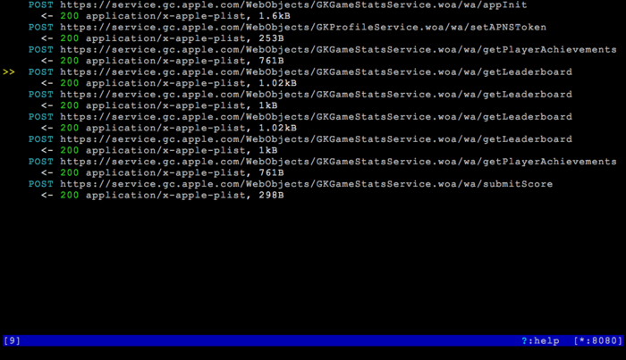
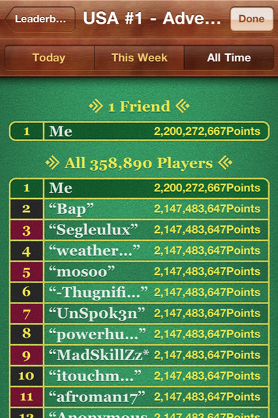

.. _gamecenter:

Setting highscores on Apple's GameCenter
========================================

The setup
---------

In this tutorial, I'm going to show you how simple it is to creatively
interfere with Apple Game Center traffic using mitmproxy. To set things up,
:ref:`install the mitmproxy root certificate <certinstall>`. Then
start mitmproxy on your desktop, and configure the iPhone to use it as a proxy.

Taking a look at the Game Center traffic
----------------------------------------

Lets take a first look at the Game Center traffic. The game I'll use in this
tutorial is `Super Mega Worm`_ - a great little retro-apocalyptic sidescroller for the iPhone:

.. image:: supermega.png
    :align: center

After finishing a game (take your time), watch the traffic flowing through
mitmproxy:

We see a bunch of things we might expect - initialisation, the retrieval of
leaderboards and so forth. Then, right at the end, there's a POST to this
tantalising URL:

.. code-block:: none

    https://service.gc.apple.com/WebObjects/GKGameStatsService.woa/wa/submitScore

The contents of the submission are particularly interesting:

.. code-block:: xml

    <!--(block|syntax("xml"))-->
    <plist version="1.0">
      <dict>
        <key>scores</key>
        <array>
          <dict>
            <key>category</key>
            <string>SMW_Adv_USA1</string>
            <key>context</key>
            <integer>0</integer>
            <key>score-value</key>
            <integer>0</integer>
            <key>timestamp</key>
            <integer>1363515361321</integer>
          </dict>
        </array>
      </dict>
    </plist>
    <!--(end)-->

This is a `property list`_, containing an identifier for the game,
a score (55, in this case), and a timestamp. Looks pretty simple to mess with.

Modifying and replaying the score submission
--------------------------------------------

Lets edit the score submission. First, select it in mitmproxy, then press
:kbd:`enter` to view it. Make sure you're viewing the request, not the response -
you can use :kbd:`tab` to flick between the two. Now press :kbd:`e` for edit. You'll
be prompted for the part of the request you want to change - press :kbd:`r` for
raw body.  Your preferred editor (taken from the EDITOR environment variable) will
now fire up. Lets bump the score up to something a bit more ambitious:

.. code-block:: xml

    <!--(block|syntax("xml"))-->
    <plist version="1.0">
      <dict>
        <key>scores</key>
        <array>
          <dict>
            <key>category</key>
            <string>SMW_Adv_USA1</string>
            <key>context</key>
            <integer>0</integer>
            <key>score-value</key>
            <integer>2200272667</integer>
            <key>timestamp</key>
            <integer>1363515361321</integer>
          </dict>
        </array>
      </dict>
    </plist>
    <!--(end)-->

Save the file and exit your editor.

The final step is to replay this modified request. Simply press :kbd:`r` for replay.

The glorious result and some intrigue
-------------------------------------

And that's it - according to the records, I am the greatest Super Mega Worm
player of all time.

There's a curious addendum to this tale. When I first wrote this tutorial, all
the top competitors' scores were the same: 2,147,483,647 (this is no longer the
case, because there are now so many fellow cheaters using this tutorial). If
you think that number seems familiar, you're right: it's 2^31-1, the maximum
value you can fit into a signed 32-bit int. Now let me tell you another
peculiar thing about Super Mega Worm - at the end of every game, it submits
your highest previous score to the Game Center, not your current score.  This
means that it stores your highscore somewhere, and I'm guessing that it reads
that stored score back into a signed integer. So, if you _were_ to cheat by the
relatively pedestrian means of modifying the saved score on your jailbroken
phone, then 2^31-1 might well be the maximum score you could get. Then again,
if the game itself stores its score in a signed 32-bit int, you could get the
same score through perfect play, effectively beating the game. So, which is it
in this case? I'll leave that for you to decide.

.. _Super Mega Worm: https://itunes.apple.com/us/app/super-mega-worm/id388541990?mt=8
.. _property list: https://en.wikipedia.org/wiki/Property_list
